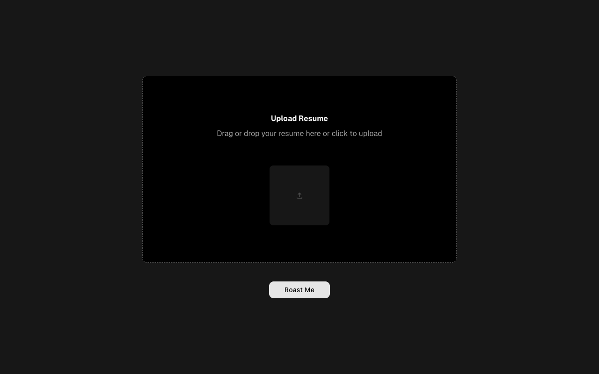
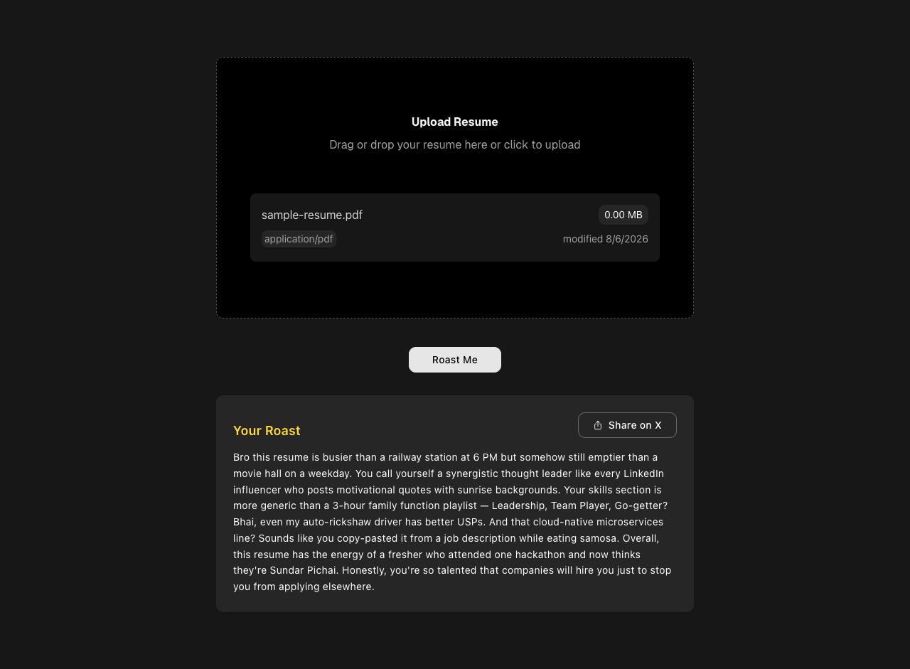
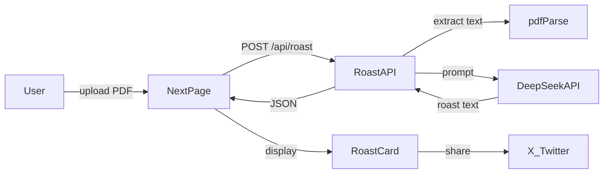

<div align="center">

# Rize Plus

**AI-powered resume roaster — upload your PDF and get a savage, shareable roast with desi humor.**

[](https://rizeplus.vercel.app)
[](https://github.com/ashishxjhaa/rizeplus/stargazers)
[](https://github.com/ashishxjhaa/rizeplus/network/members)
[](https://github.com/ashishxjhaa/rizeplus/issues)

[Live Demo](https://rizeplus.vercel.app) · [Report Bug](https://github.com/ashishxjhaa/rizeplus/issues) · [Request Feature](https://github.com/ashishxjhaa/rizeplus/issues)

</div>

---

## Preview

<table align="center">
  <tr>
    <td align="center"><b>Upload</b></td>
    <td align="center"><b>Roast</b></td>
  </tr>
  <tr>
    <td></td>
    <td></td>
  </tr>
</table>

## Features

- **PDF upload** — drag-and-drop or click-to-upload via `react-dropzone`
- **Server-side extraction** — `pdf-parse` extracts resume text on the server
- **AI roast generation** — DeepSeek (`deepseek-chat`) via OpenAI-compatible SDK
- **Desi humor** — Indian cultural references baked into the roast prompt
- **Share on X** — one-click Twitter intent with pre-filled text
- **Dark UI** — neutral-900 background with `#FFDA37` accent
- **Loading & toasts** — spinner on submit, error feedback via Sonner

## Tech Stack

Built with Next.js 15, React 19, TypeScript, Tailwind CSS 4, DeepSeek, pdf-parse, Motion, and shadcn/ui.

<p align="center">
  
  
  
  
  
  
  
</p>

## Getting Started

### Prerequisites

- [Bun](https://bun.sh/) (recommended) or Node.js 20+
- [DeepSeek API key](https://platform.deepseek.com/)

### Installation

```bash
git clone https://github.com/ashishxjhaa/rizeplus.git
cd rizeplus
bun install
```

Create a `.env.local` file in the project root (see [Environment Variables](#environment-variables)):

```bash
cp .env.example .env.local
```

Start the development server:

```bash
bun run dev
```

Open [http://localhost:3000](http://localhost:3000) in your browser.

> **Note:** `npm`, `yarn`, and `pnpm` also work — replace `bun` with your package manager of choice.

## Environment Variables

| Variable | Required | Description |
|----------|----------|-------------|
| `DEEPSEEK_API_KEY` | Yes | API key for DeepSeek (`https://api.deepseek.com`) |

## Scripts

| Command | Description |
|---------|-------------|
| `bun run dev` | Start the development server on port 3000 |
| `bun run build` | Create a production build |
| `bun run start` | Start the production server |

## Project Structure

```
rizeplus/
├── src/
│   ├── app/
│   │   ├── page.tsx              # Upload UI + roast trigger
│   │   ├── layout.tsx            # Root layout, metadata, Toaster
│   │   └── api/roast/route.ts    # PDF parse + DeepSeek roast
│   ├── components/
│   │   ├── RoastCard.tsx         # Roast display + Share on X
│   │   └── ui/                   # file-upload, spinner
│   └── lib/utils.ts
├── docs/screenshots/             # README preview images
├── public/
└── package.json
```

## API

### `POST /api/roast`

Upload a PDF resume and receive an AI-generated roast.

| | |
|---|---|
| **Request** | `multipart/form-data` with field `file` (PDF) |
| **Response** | `{ roast: string }` or `{ error: string }` |
| **Runtime** | Node.js (required for `pdf-parse` and `Buffer`) |

## Architecture



## Deployment

Rize Plus is deployed on [Vercel](https://rizeplus.vercel.app). To deploy your own instance:

1. Push the repo to GitHub
2. Import the project in Vercel
3. Set `DEEPSEEK_API_KEY` in environment variables
4. Deploy

## Author

**Ashish** — [GitHub](https://github.com/ashishxjhaa)

---
